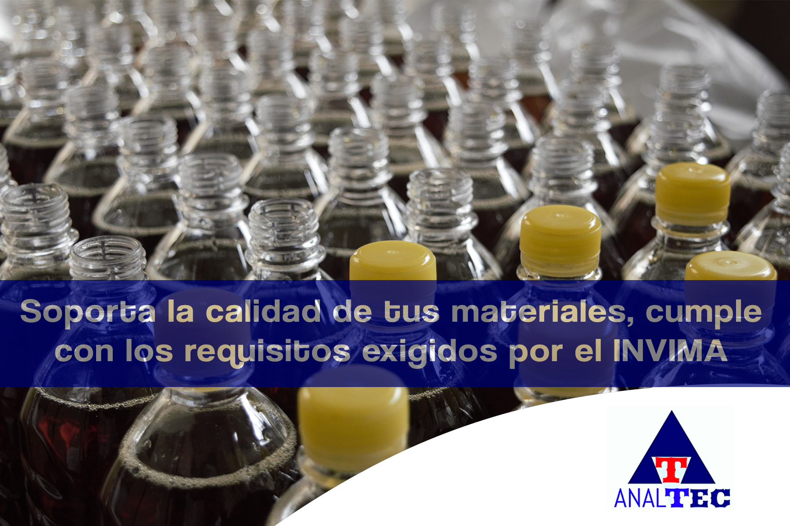

En el proceso de producción de un alimento es importante tener en cuenta tanto las materias primas como los materiales, objetos, equipos y equipamientos vinculado dentro de la cadena de producción.

> ¿Revisar los materiales?                                                                                                                                      Pero eso me lo suministra mi proveedor de confianza

 Revisa que tu proveedor cumpla con las normativas estipuladas, para que no te lleves una sorpresa en la auditoria.
 

Asi es, los elementos que hacen parte de las maquinarias hasta los materiales que hacen parte del envasado son disposición de los materiales, objetos, equipos y equipamientos en una la línea de producción y son vigilados y controlados por el invima.

## Requisitos de aptitud sanitaria exigidos por el ministerio de salud y protección social de Colombia. 

La aptitud sanitaria de los materiales es fundamental para garantizar el control de la migración en la interacción material-alimento y así asegurar que el alimento no presenta un riesgo alguno para la salud del consumidor.

## ¿Dónde puedo consultar las normativas?

En Colombia las empresas de alimentos, rigen sus procesos de acuerdo al cumplimiento de la resolución 2674 de 2013 que establece los requisitos sanitarios que deben cumplir las personas naturales y/o jurídicas que ejerzan actividades de fabricación, procesamiento, preparación, envase, almacenamiento, transporte, distribución y comercialización de alimentos y materias primas de alimentos. 

>>El capítulo II de la resolución 2674 hace énfasis de las condiciones generales de los equipos y utensilios utilizados en el procesamiento, fabricación, preparación, envasado y expendio de alimentos con la cual todos estos materiales deben estar diseñados, construidos, instalados y mantenidos de manera que se evite la contaminación del alimento, facilite la limpieza y desinfección de sus superficies y permitan desempeñar adecuadamente el uso previsto.

Así mismo, todo material en contacto con el alimento en la etapa de producción y envasado o empacado debe seguir los requisitos de acuerdo a la resolución 683 de 2012. 

## ¡Cuidado! - La normativa  vincula más normativas ... Sigue leyendo

La resolución establece los requisitos de control para la migración en la interacción material-alimento y establece los ensayos fisicoquímicos que debe cumplir para el uso selectivo y adecuado de los materiales según la clasificación del material. Así los materiales metálicos están regidos por la resolución 4142 de 2012, los materiales poliméricos por la 4143 de 2012, materiales celulósicos por la resolución 834 de 2013 y por último los materiales de vidrio y cerámica por la 835 de 2013.    

## Esta es una normativa mundial. 
En el margen de las resoluciones que establecen los requisitos sanitarios está el cumplimiento de que todo material, objeto, equipo o equipamiento que interactué con los alimentos debe estar incluido en listas positivas, listas avaladas por entidades como la unión europea, la Mercosur y la FDA. 

## Al momento de la auditoria, verifique lo siguiente
Aspecto a tomar en cuenta son los límites de migración global, migración específica, migración de metales pesados y sustancias nocivas para la salud como el bisfenol A.  Los ensayos deben estar respaldados por laboratorios que certifique que los materiales no presentan fenómenos de migración para generar un riesgo apreciable para la salud del consumidor.  

>>El Instituto Nacional de Vigilancia de Medicamentos y Alimentos (INVIMA) es la autoridad sanitaria de orden nacional encargada de realizar los debidos controles para el debido cumplimiento de los requisitos sanitarios de los materiales. 

El INVIMA visita las empresas periódicamente para vigilar los diferentes procesos y asegurar que no se generen riesgos públicos que puedan atentar contra la salud del consumidor.  

