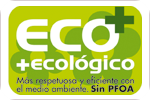

El teflón es una marca registrada por la empresa química americana Chemours perteneciente al grupo Dupont. La marca Teflon™ 
ha llegado a representar una variedad de beneficios para los consumidores, debido a que es la marca de recubrimientos de 
sartenes antiadherentes más famosa del mundo. Las propiedades de fácil limpieza, antiadherencia y durabilidad, facilitan el 
trabajo en la cocina de establecimientos de alimentos y hogares de todo el mundo. 

>Existe una controversia muy fuerte debido a los rumores sobre la toxicidad del teflón. 

Los sartenes son elaborados con materiales metálicos, cerámicos, poliméricos y vidrio que estarán en contacto con los alimentos. 
Por tanto, cada material debe cumplir con las políticas de regulación de migración de sustancias tóxicas y aptitud sanitaria de 
los materiales para asegurar inocuidad del alimento.

>El teflón es tóxico solo cuando está en estado gaseoso. El teflón es un material inerte
>y con alta estabilidad, pero a partir de los 260º C, comienza a descomponerse por un proceso 
>de termo-degradación emitiendo gases tóxicos perjudiciales para la salud.

## ¿Cómo están hechos los sarténes?
La mayoría de sartenes tienen cuerpo metálico de acero inoxidable, aluminio o cobre. La propiedad de antiadherencia que se busca 
a la hora de saltear los alimentos, la confiere a través de un revestimiento polimérico de Politetrafluoroetileno conocido por sus siglas como PTFE,
 y el material o vehículo que ayuda a unir el metal base y el PTFE es un ácido conocido como perfluorooctanoico llamado por sus siglas PFOA y también conocido en la industria como C8. 

 El teflón o PTFE es la película oscura de nuestros sartenes y es un material apto para entrar en la industria en contacto con los alimentos,
la precaución y conciencia que debe tener los fabricantes locales y consumidores es el control de sustancia como la PFOA.  

>Estudios han demostrado una relación entre pacientes con PFOA en sangre y tumores cancerígenos. 
>En realidad, el PFOA no forma parte del teflón en sentido estricto, pero puede existir una exposición directa entre el alimento y el PFOA cuando la capa del teflón esta rayada o desgastada. 

>Así que, examine los sartenes que actualmente utiliza.

Si encuentra alguna abolladura en el revestimiento en el teflón, o peor aún, si puede observar el material metálico del cuerpo del sartén, es probable que, 
al momento de preparar los alimentos ingiera sustancias o monómeros pertenecientes al PFOA. 
Por tanto, el teflón no es tóxico ni cancerígeno en sí mismo, si no el PFOA. Actualmente muchas empresas no utilizan PFOA como adherente metal-teflón, ni para fabricar sus utensilios, debido a diversas regulaciones expedidas por la Unión Europea. 

### Algunos consejos a la hora de comprar 

Por seguridad, a la hora de comprar un sartén, asegúrate que aparezca en el rótulo de la marca, indicativos como PFOA free/libre de PFOA , como se muestra en la figura

### Resumen:

•	El PFOA es tóxico y cancerígeno y contamina el medio ambiente.
•	El Teflón o PTFE no son tóxicos, pero si se somete a temperaturas cercanas o superiores a los 250°C generará gases tóxicos perjudiciales para la salud.

